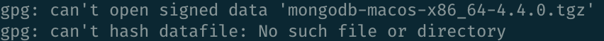
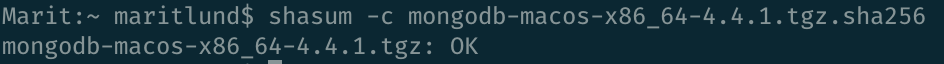
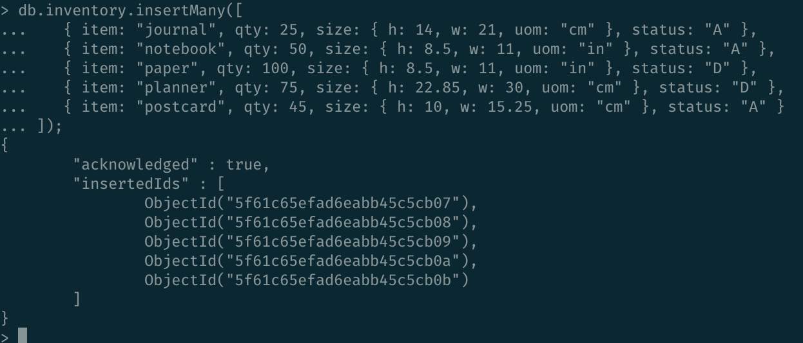
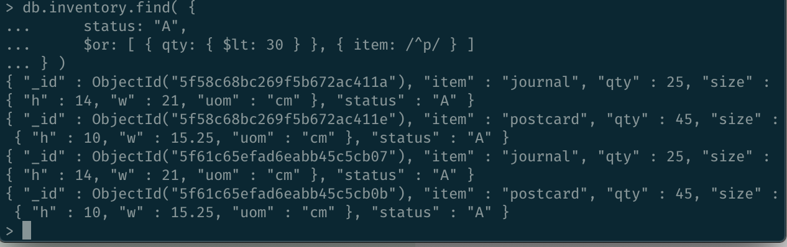
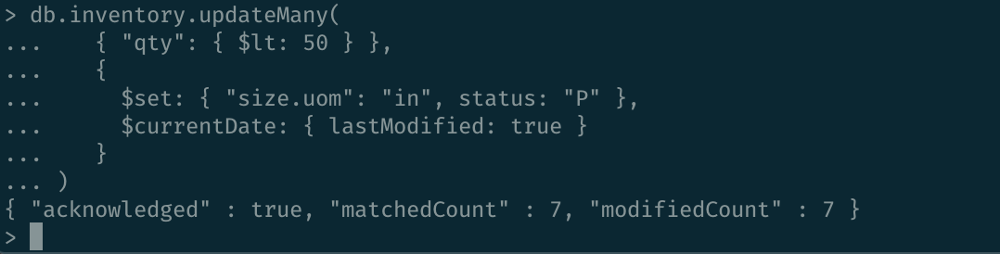
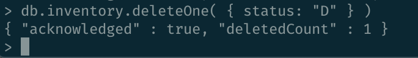
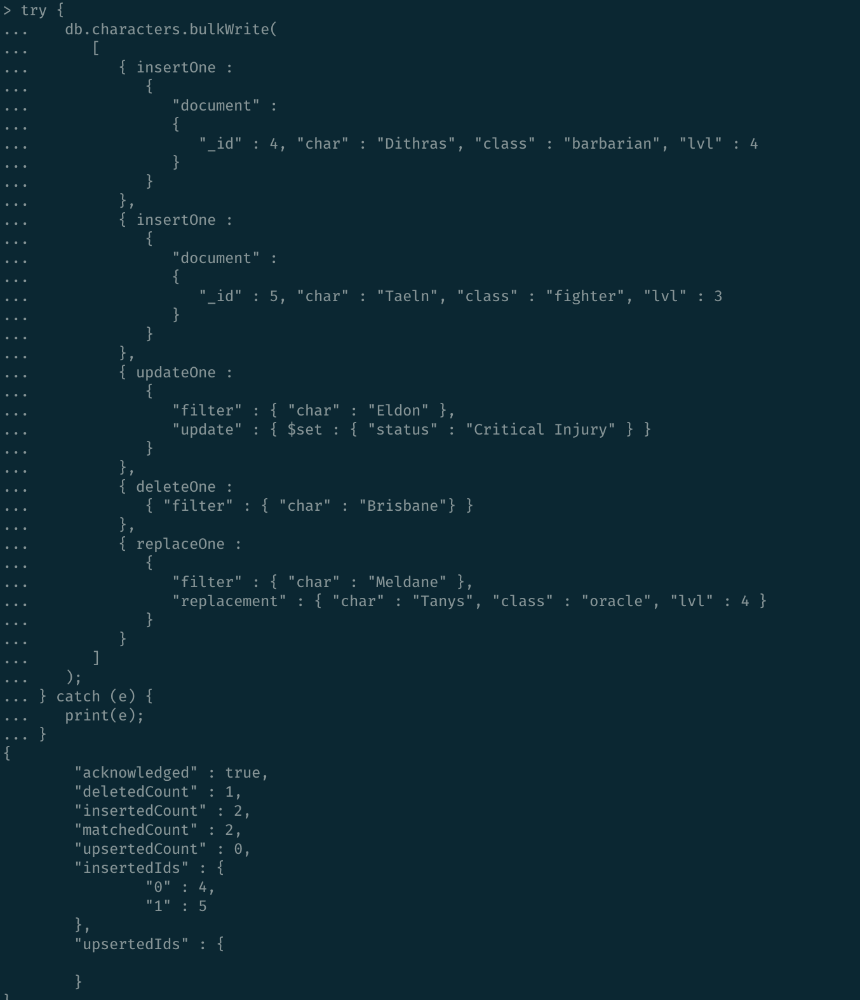
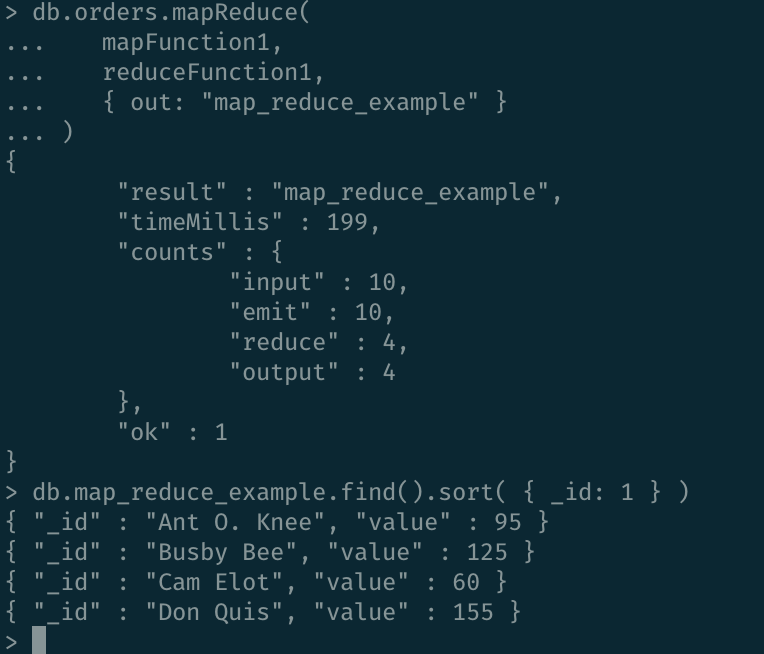
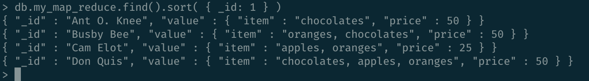

# Software Technology Experiment 3

## Installation and verification

I experienced no technical problems during installation. When verifying the installation I encountered an error at step 4 which I didn't figure out how to solve. I asked in the expass discussion forum on Canvas as well, but did not receive any replies. Using the SHA verification instead was successful. 



## CRUD operations

Screenshots from the CRUD operations can be seen below. 







## MapReduce
### Example



### Own implementation

I implemented a map reduce function that returns what product each customer has spent the most money on. If the customer has spent an equal amount of money on several products, all relevant products are returned and the price is per item. This is useful for shops and supermarkets that have customer programs / clubs as they can offer personalized discounts or coupons to the customer based on their likes. 

The reduce function is pretty sizeable as it totals the price for each unique item the customer has bought, and then finds the item the customer has spent the most money on. Might be a shorter way to write this if you're well-versed in mongodb. Code and result from running it below. 

```
var mapFunction3 = function() {
    for (var idx = 0; idx < this.items.length; idx++) {
       var value = { item: this.items[idx].sku, count: this.items[idx].qty , price: this.items[idx].price };

       emit(this.cust_id, value);
    }
};

var reduceFunction3 = function(keyCustId, valuesPrices) {
   totalPriceList = []
   highestValueItem = {item: "", price: 0}

   for (var idx = 0; idx < valuesPrices.length; idx++) {
   	 if (totalPriceList.some(e => e.item === valuesPrices[idx].item)) {
   	 	totalPrice = (totalPriceList.find(e => e.item === valuesPrices[idx].item))
   	 	totalPrice.price += (valuesPrices[idx].price)*(valuesPrices[idx].count);
	 }
	 else{
	   totalPrice = {item: "", price: 0}
	   totalPrice.item = valuesPrices[idx].item;
	   totalPrice.price += (valuesPrices[idx].price)*(valuesPrices[idx].count);
	   totalPriceList.push(totalPrice);
	 }
   };

   for (var idx = 0; idx < totalPriceList.length; idx++) {
     if (totalPriceList[idx].price > highestValueItem.price){
   	 	highestValueItem = totalPriceList[idx];
   	 }
   	 else if (totalPriceList[idx].price == highestValueItem.price){
   	 	highestValueItem.item += ", " + totalPriceList[idx].item;
   	 }

   };

   return highestValueItem;
};

db.orders.mapReduce(
   mapFunction3,
   reduceFunction3,
   { out: "my_map_reduce" }
)

db.my_map_reduce.find().sort( { _id: 1 } )
```


